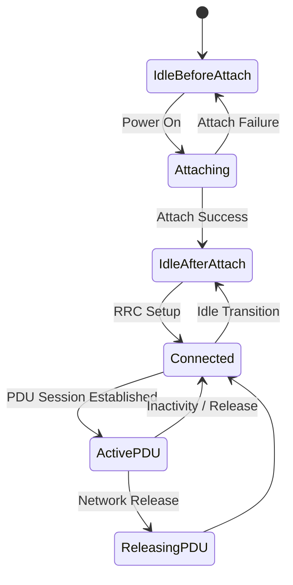

# 5G Core Network Simulator

## Overview

**5G Core Network Simulator** is a high-performance, Go-based simulation framework designed for **5G Core research, prototyping, and validation**.  
It provides a realistic emulation of **User Equipment (UE)**, with support for **3GPP Service Exposure APIs**, **stateful UE lifecycle management**, and **traffic modeling**.

This simulator is optimized for:  
- **Vendors** validating service exposure interfaces against 3GPP standards  
- **Operators and researchers** testing UE mobility, policy control, and session lifecycles  
- **CI/CD pipelines** for automated regression testing without deploying a full 5G Core  

## Key Features

- Standards-compliant **UE State Machine** (Idle / Attach / Connected / PDU Session)  
- **Markov-based stochastic modeling** for UE transitions  
- **Inter-Task Communication (ITC)** library with lightweight actors and mailboxes  
- **3GPP Service-Based Interface (SBI) APIs** for service exposure (AMF, SMF, PCF)  
- **OAM APIs** for simulation management and orchestration  
- **Scalable profiles** supporting thousands of UEs and gNBs  
- **CI/CD ready** with YAML-based simulation profiles  

## Architecture

The simulator consists of three main components:  

- **UE Engine**: Manages UE lifecycle, state transitions, PDU sessions, inactivity timers  
- **gNB Model**: Anchors UE sessions, supports multi-UE simulation  
- **3GPP Service Exposure Layer**: Implements 3GPP Network APIs for event exposure and dynamic UE policies (AMF, SMF, and PCF functions)  

### UE State Machine



## Configuration

The simulator is configured via a **YAML file**.  

### Example `config.yaml`

```yaml
useTLS: false
httpVersion: 2
fqdn: core-simulator
sbiPort: 8080
oamPort: 8081
initOnStartup: true # Load default profile on startup

simulationProfile:
  plmn:
      mcc: "001"
      mnc: "06"
  dnn: "internet"
  slice:
    sst: 1
    sd: "FFFFFF"
  numOfUe: 5
  numOfgNB: 40
  arrivalRate: 1
```

### Configuration Parameters

| Parameter | Type | Description |
|-----------|------|-------------|
| `useTLS` | bool | Enable TLS for SBI/OAM |
| `httpVersion` | int | Supported HTTP version (1 or 2) |
| `fqdn` | string | Simulator FQDN |
| `sbiPort` | int | SBI API port |
| `oamPort` | int | OAM API port |
| `initOnStartup` | bool | Load default config at startup, CLI configuration ignored |
| `simulationProfile.plmn.mcc` | string | Mobile Country Code |
| `simulationProfile.plmn.mnc` | string | Mobile Network Code |
| `simulationProfile.dnn` | string | Default DNN |
| `simulationProfile.slice.sst` | int | Slice/Service Type |
| `simulationProfile.slice.sd` | string | Slice Differentiator |
| `simulationProfile.numOfUe` | int | Number of simulated UEs |
| `simulationProfile.numOfgNB` | int | Number of simulated gNBs |
| `simulationProfile.arrivalRate` | int | UE arrival rate (per time unit) |

## Supported APIs

The simulator exposes two categories of REST APIs.  

### 3GPP SBI APIs (default: `:8080`)  

The simulator supports event exposure and policy APIs aligned with **3GPP TS 29-series** (Release 17):  

- **`Nsmf_EventExposure`** (3GPP TS 29.502 Rel-17) – Session management event exposure  
- **`Namf_Events`** (3GPP TS 29.518 Rel-17) – UE mobility and registration events  
- **`Npcf_PolicyAuthorization`** (3GPP TS 29.514 Rel-17) – Dynamic policy control for UEs  

These APIs enable service exposure scenarios, such as:  
- UE attach/detach monitoring  
- PDU session lifecycle tracking  
- Policy rule enforcement  

### OAM APIs (default: `:8081`)  

| Method | Endpoint | Description |
|--------|----------|-------------|
| `POST` | `/core-simulator/v1/start` | Start simulation |
| `POST` | `/core-simulator/v1/stop` | Stop simulation |
| `GET` | `/core-simulator/v1/status` | Query simulation status |
| `POST` | `/core-simulator/v1/configure` | Configure network parameters |

## CLI Tool

The CLI (`cnsim-cli`) provides direct control for launching and managing simulations.  
See the full [CLI documentation](/docs/cli.md).  

- Interactive shell with commands: `init`, `start`, `status`, `stop`, `loadprofile`  
- Reads `cnsim-profile.yaml` for simulation profiles  
- Honors `initOnStartup` flag from config, meaning that startup config will not be overwritten by the cli  

## CI/CD Integration

- Define the profile in `config.yaml` for automated runs  
- Launch simulator in CI pipelines (GitHub Actions, Jenkins, GitLab)

## Licensing & Support
This project is provided under an open license. Commercial support available on request.  